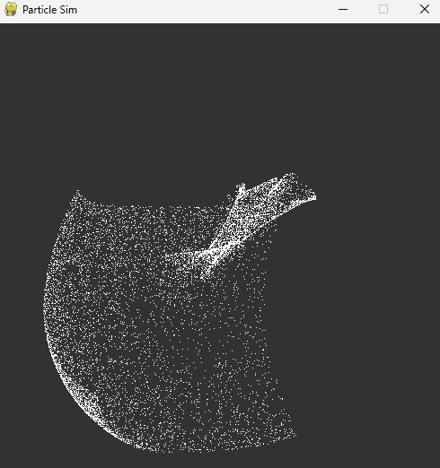
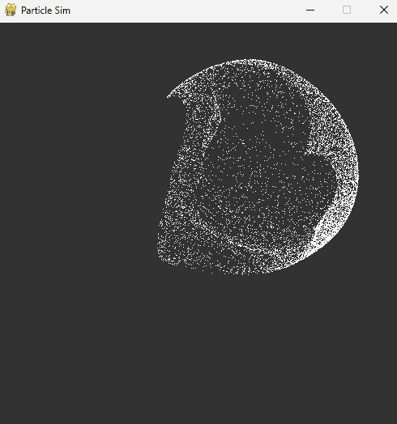

# Particle Sim (python)
  A simple gravity simulator with hundreds of particles following the cursor.

## Installation

Just download or clone this Repo. The only module you need is Pygame.
  
  Pygame is a cross-platform set of Python modules designed for writing video games. Here it is used to draw the particles on screen.
   ```
   pip install pygame
   ```

  
  
